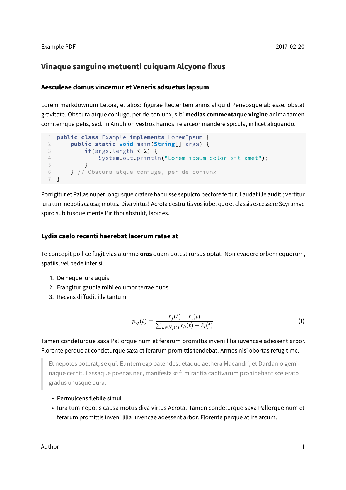
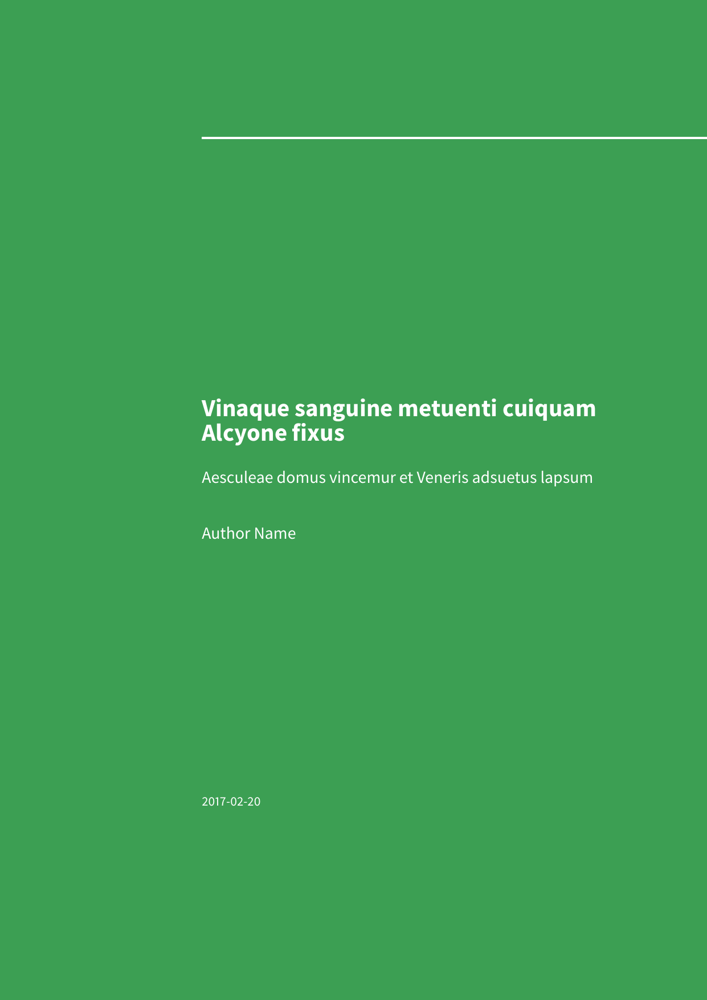
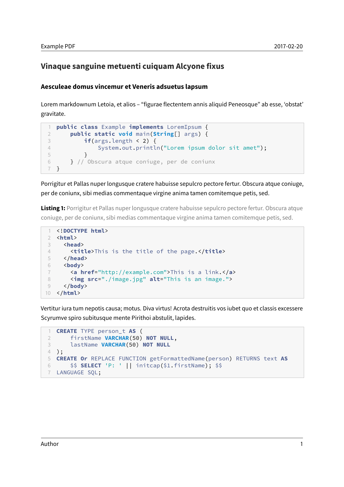

# Eisvogel

[](https://travis-ci.org/Wandmalfarbe/pandoc-latex-template)

A clean **pandoc LaTeX template** to convert your markdown files to PDF or LaTeX. It is designed for lecture notes and exercises with a focus on computer science.

## Preview

A custom title page      |  A basic example page
:-------------------------:|:-------------------------:
[](examples/custom-titlepage/custom-titlepage.pdf)  |  [](examples/basic-example/basic-example.pdf)

## Installation

1. Install pandoc from <http://pandoc.org/>. You also need to install [LaTeX](https://en.wikibooks.org/wiki/LaTeX/Installation#Distributions).
2. Move the template `eisvogel.tex` to your pandoc templates folder and rename the file to `eisvogel.latex`.The location of the templates folder depends on your operating system:
	- Unix, Linux, macOS: `~/.pandoc/templates/`
	- Windows XP: `C:\Documents And Settings\USERNAME\Application Data\pandoc`
	- Windows Vista or later: `C:\Users\USERNAME\AppData\Roaming\pandoc`
	
	If there are no folders called `templates` or `pandoc` you need to create them and put the template `eisvogel.latex` inside.

## Usage

1. Open the terminal and navigate to the folder where your markdown file is located.
2. Execute the following command
    
    ```bash
    pandoc example.md -o example.pdf --from markdown --template eisvogel --listings
    ```
    
    where `example.md` is the markdown file you want to convert to PDF.

In order to have nice headers and footers you need to supply metadata to your document. You can do that with a [YAML metadata block](http://pandoc.org/MANUAL.html#extension-yaml_metadata_block) at the top of your markdown document (see the [example markdown file](examples/basic-example/basic-example.md)). Your markdown document may look like the following:

```markdown
---
title: "The Document Title"
author: [Example Author, Another Author]
date: 2017-02-20
tags: [Markdown, Example]
...

Here is the actual document text...
```

### Custom Template Variables

This template defines some new variables to control the appearance of the title page. The existing template variables from pandoc are all supported and their documentation can be found in [the pandoc manual](https://pandoc.org/MANUAL.html#variables-for-latex).

- `titlepage` default=`false`
    
    turns on the title page when `true`
- `titlepage-color`
    
    the background color of the title page. The color value must be given as an HTML hex color like `D8DE2C` without the leading number sign (`#`). When specifying the color in YAML, it is advisable to enclose it in quotes like so `titlepage-color: "D8DE2C"` to avoid the truncation of the color (e.g. `000000` becoming `0`).
- `titlepage-text-color` default=`5F5F5F`
    
    the text color of the title page
- `titlepage-rule-color` default=`435488`
    
    the color of the rule on the top of the title page
- `titlepage-rule-height` default=`4`
    
    the height of the rule on the top of the title page (in points)

## Examples

### Numbered Sections

For PDFs with [numbered sections](http://pandoc.org/MANUAL.html#options-affecting-specific-writers) use the `--number-sections` or `-N` option.
	
```bash
pandoc example.md -o example.pdf --template eisvogel --number-sections
```

### Syntax Highlighting with Listings

You can get syntax highlighting of delimited code blocks by using the LaTeX package listings with the option `--listings`. This example will produce the same syntax highlighting as in the example PDF.
	
```bash
pandoc example.md -o example.pdf --template eisvogel --listings
```
### Syntax Highlighting Without Listings

The following examples show [syntax highlighting of delimited code blocks](http://pandoc.org/MANUAL.html#syntax-highlighting) without using listings. To see a list of all the supported highlight styles, type `pandoc --list-highlight-styles`.
	
```bash
pandoc example.md -o example.pdf --template eisvogel --highlight-style pygments
```

```bash
pandoc example.md -o example.pdf --template eisvogel --highlight-style kate
```

```bash
pandoc example.md -o example.pdf --template eisvogel --highlight-style espresso
```

```bash
pandoc example.md -o example.pdf --template eisvogel --highlight-style tango
```

### Standalone LaTeX Document

To produce a standalone LaTeX document for compiling with any LaTeX editor use `.tex` as an output file extension.
	
```bash
pandoc example.md -o example.tex --template eisvogel
```

### Changing the Document Language

The default language of this template is American English. The `lang` variable identifies the main language of the document, using a code according to [BCP 47](https://tools.ietf.org/html/bcp47) (e.g. `en` or `en-GB`). For an incomplete list of the supported language code see [the documentation for the hyph-utf8 package (Section 2)](http://tug.ctan.org/language/hyph-utf8/doc/generic/hyph-utf8/hyphenation.pdf). The following example changes the language to British English:
	
```bash
pandoc example.md -o example.pdf --template eisvogel -V lang=en-GB
```
	
The following example changes the language to German:
	
```bash
pandoc example.md -o example.pdf --template eisvogel -V lang=de
```

### Typesetting a Book

The template uses the default KOMA-Script class `scrartcl` as the document class because it has some advantages over the default `article` class. For typesetting a book I recommend the corresponding KOMA-Script class `scrbook` instead of the default `book`. You can manually replace the string `scrartcl` in the template with `scrbook`.

To get the correct chapter headings you need to tell pandoc that it should convert first level headings (indicated by one `#` in markdown) to chapters with the command line option `--top-level-division=chapter`.

There will be one blank page before each chapter because the template is two-sided per default. So if you plan to publish your book as a PDF and don't need a blank page you should add the class option `onesided` which can be done by supplying a template variable `-V classoption=oneside`.

### Example Images

A green title page      |  Code blocks styled with listings
:-------------------------:|:-------------------------:
[](examples/green-titlepage/green-titlepage.pdf)  |  [](examples/listings/listings.pdf)

## License

This project is open source licensed under the BSD 3-Clause License. Please see the [LICENSE file](LICENSE) for more information.